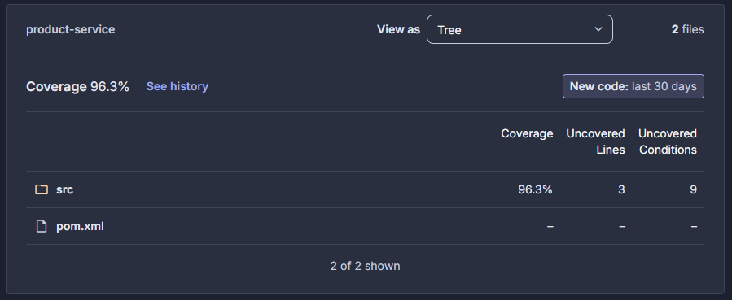

# SOAT Product Microservice (soat-ms-products)

Microsserviço responsável pelo gerenciamento do catálogo de produtos da rede de Fast Food. Este serviço permite a criação, edição, remoção e listagem de produtos, categorizando-os em Lanche, Bebida, Sobremesa e Acompanhamento, servindo como base para a montagem de pedidos.

## Sobre o Projeto

Este projeto foi desenvolvido utilizando **Java 21** e **Spring Boot 3**, seguindo os princípios da **Clean Architecture** (Arquitetura Limpa) para garantir o desacoplamento entre as entidades de domínio, casos de uso e implementações de infraestrutura.

### Funcionalidades

* **Gestão de Produtos:** CRUD completo (Criar, Atualizar, Buscar e Deletar) de produtos.
* **Categorização:** Organização dos itens em categorias fixas (Lanche, Bebida, Sobremesa, Acompanhamento).
* **Persistência Relacional:** Armazenamento seguro e estruturado utilizando PostgreSQL.
* **Migração de Dados:** Controle de versão do esquema de banco de dados via Flyway.
* **Health Check:** Endpoint para verificação de saúde da aplicação e prontidão do Kubernetes.

## Tecnologias Utilizadas

* **Linguagem:** Java 21
* **Framework Web:** Spring Boot 3.4.5
* **Banco de Dados:** PostgreSQL 15
* **Migração de Dados:** Flyway
* **Documentação:** OpenAPI (Swagger UI)
* **Mapeamento:** MapStruct
* **Containerização:** Docker
* **Orquestração:** Kubernetes (EKS)
* **CI/CD:** GitHub Actions
* **Qualidade de Código:** SonarQube, Jacoco

## Políticas de Branch e Segurança

Para garantir a qualidade e a estabilidade do ambiente produtivo, foram configuradas regras de proteção no repositório (Branch Protection Rules):

* **Bloqueio de Commits na Main:** Não é permitido realizar commits diretamente na branch `main`. Toda alteração deve vir de uma branch auxiliar (feature/bugfix).
* **Obrigatoriedade de Pull Requests (PR):** Merges para a `main` só podem ser realizados através de Pull Requests devidamente abertos e revisados.
* **Verificação de Status (CI):** O merge do PR só é habilitado se a esteira de Integração Contínua (CI) for executada com sucesso. Isso inclui:
    * Compilação do projeto (Maven).
    * Execução e aprovação de todos os testes unitários.
    * Validação de qualidade e cobertura de código pelo SonarQube (Quality Gate).

## Configuração Local

### Pré-requisitos

* Docker e Docker Compose
* Java 21 (Opcional, caso queira rodar fora do container)
* Maven (ou utilizar o wrapper `./mvnw` incluso)

### Instalação e Execução

A maneira mais simples de rodar a aplicação localmente, incluindo o banco de dados, é através do Docker Compose.

1.  **Subir a aplicação e o banco de dados:**

``bash
docker-compose up --build
``

2.  **Acessar a API:**
    * A API estará disponível em: `http://localhost:8080`
    * **Documentação Swagger:** `http://localhost:8080/swagger-ui.html`
    * **Spec OpenAPI:** `http://localhost:8080/v3/api-docs`

3.  **Limpar o ambiente:**

``bash
docker-compose down
``

## Testes

O projeto inclui uma suíte de testes unitários utilizando JUnit 5 e Mockito para validar as regras de negócio e os casos de uso.

**Executar todos os testes via terminal:**

``bash
./mvnw test
``

## Cobertura de Testes

Utilizamos o **SonarQube** para monitorar a qualidade do código e garantir que a cobertura de testes se mantenha elevada. O pipeline de CI/CD está configurado para exigir um padrão mínimo de qualidade (Quality Gate) antes de permitir o merge.

Abaixo está a evidência da cobertura atual do projeto:

> A métrica acima reflete a cobertura de linhas e branches analisada durante a última execução da pipeline.

## CI/CD e Deploy

O deploy é automatizado via **GitHub Actions** (`.github/workflows/ci-cd.yml`) com as seguintes etapas:

1.  **Build & Test:**
    * Configura o JDK 21.
    * Executa o build do Maven.
    * Roda os testes unitários.
2.  **Sonar Analysis:**
    * Envia o relatório de cobertura (Jacoco) e análise estática para o SonarQube.
3.  **Docker Push:**
    * Constrói a imagem Docker.
    * Realiza o push para o Amazon ECR (Elastic Container Registry).
4.  **Deploy K8s:**
    * **Condição:** Executado apenas na branch `main`.
    * Atualiza as credenciais da AWS.
    * Substitui variáveis de ambiente nos manifestos (envsubst).
    * Aplica os manifestos Kubernetes no cluster EKS.

## Recursos Kubernetes

Os manifestos de infraestrutura estão localizados na pasta `k8s/` e definem:

* **ConfigMap (`k8s/configmaps`):** Variáveis de ambiente não sensíveis (Portas, Profiles).
* **Secrets (`k8s/secrets`):** Credenciais sensíveis do banco de dados (codificadas em Base64).
* **Deployment (`k8s/deployments`):** Gerencia os Pods da aplicação, definindo réplicas e estratégia de atualização.
* **Service (`k8s/services`):** Expondo a API através de um LoadBalancer.
* **HPA (`k8s/hpa`):** Horizontal Pod Autoscaler configurado para escalar a aplicação baseado no uso de CPU (target 70%).